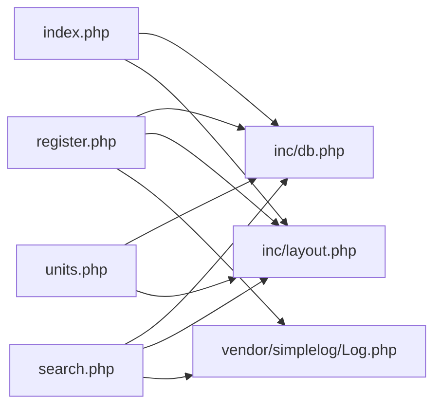

# legacy/item-bank-php 아키텍처 노트

> 분석 대상: `legacy/item-bank-php` (읽기 전용, 코드 미수정)

## 모듈 개요

문항 등록 · 검색 · 단원별 공개 문항 수 조회 3개 화면으로 구성된 PHP 문항 은행 모듈이다.
공통 DB 연결(`inc/db.php`)과 레이아웃(`inc/layout.php`)을 각 화면이 공유한다.
외부 라이브러리는 로깅용 `vendor/simplelog/Log.php` 하나뿐이다.
등록된 문항은 `status='R'`(검수중)로 시작해 검수 완료(`A`) 전까지 검색에 노출되지 않는다.
프레임워크 없이 스크립트 파일이 곧 라우트인 구조다.

## 폴더 구조

```
legacy/item-bank-php/
├── Dockerfile
├── index.php              (14줄)  — 홈, 메뉴
├── register.php           (177줄) — 문항 등록 (GET/POST)
├── search.php              (731줄) — 문항 검색 (GET)
├── units.php               (48줄)  — 단원 목록
├── inc/
│   ├── db.php               (37줄)  — DB 연결, HTML 이스케이프 h()
│   └── layout.php           (43줄)  — 공통 헤더/푸터
└── vendor/simplelog/
    └── Log.php              (54줄)  — 더미 외부 로깅 라이브러리
```

## 진입점 표

| URL / 화면 | 처음 실행되는 파일 | 주요 함수 호출 |
|---|---|---|
| `/index.php` (홈) | `index.php` | `render_header()` (`inc/layout.php:7`), `render_footer()` (`inc/layout.php:38`) |
| `/search.php?q=…&unit=…&level=…&tag=…&sort=…&dir=…&page=…` (문항 검색, GET) | `search.php` | `db_connect()` (`inc/db.php:7`) — 호출 지점 `search.php:713`; `buildSearchQuery()` (`search.php:42`) — 호출 지점 `search.php:722`; `renderSearchForm()` (`search.php:629`) — 호출 지점 `search.php:723`; `runSearchQuery()` (`search.php:571`) — 호출 지점 `search.php:724`; `renderResultTable()` (`search.php:647`) — 호출 지점 `search.php:725`; `Log::debug/error` (`vendor/simplelog/Log.php:23`,`:38`) |
| `/register.php` (문항 등록, GET 폼 표시 / POST 등록) | `register.php` | `db_connect()` (`register.php:17`); 선택 목록 조회 `$conn->query()` (`register.php:27`,`:34`); POST 시 `$conn->query("...FOR UPDATE")` (`register.php:87`), `$conn->prepare()`+`bind_param`+`execute` (`register.php:92-98`, `:105-108`); `Log::info/error` (`register.php:115`,`:121`) |
| `/units.php` (단원 목록) | `units.php` | `db_connect()` (`units.php:8`); `$conn->query()` (`units.php:20`) |

## 의존 관계

### Mermaid flowchart



### 호출 표 ("A → B" = A가 B를 호출)

| 방향 | 근거 |
|---|---|
| `index.php` → `inc/db.php` (require_once) | `index.php:2` |
| `index.php` → `inc/layout.php` (`render_header`, `render_footer`) | `index.php:2-3`, 호출 `index.php:5`, `:14` |
| `units.php` → `inc/db.php` (require_once, `db_connect()`) | `units.php:2`, 호출 `units.php:8` |
| `units.php` → `inc/layout.php` (`render_header`, `render_footer`, `h()`) | `units.php:3`, 호출 `units.php:5`, `:10`, `:40-43`, `:48` |
| `register.php` → `inc/db.php` (require_once, `db_connect()`) | `register.php:2`, 호출 `register.php:17` |
| `register.php` → `inc/layout.php` (`render_header`, `render_footer`, `h()`) | `register.php:3`, 호출 `register.php:19`, `:20`, `:21`, `:127`, `:144`, `:177` |
| `register.php` → `vendor/simplelog/Log.php` (`Log::info`, `Log::error`) | `register.php:4`, 호출 `register.php:115`, `:121` |
| `search.php` → `inc/db.php` (require_once, `db_connect()`, `h()`) | `search.php:20`, 호출 `search.php:713`; `h()` 호출 다수 (예: `search.php:494`, `:674-678`) |
| `search.php` → `inc/layout.php` (`render_header`, `render_footer`) | `search.php:21`, 호출 `search.php:709`, `:731` |
| `search.php` → `vendor/simplelog/Log.php` (`Log::setThreshold`, `Log::debug`, `Log::error`) | `search.php:22`, 호출 `search.php:27`, `:103`, `:528`, `:537`, `:727` |

register.php · search.php · units.php는 서로를 require 하지 않는다. 화면 간 이동은 `<a href>` 링크뿐이다 (예: `index.php:9-11`, `search.php:639`).

## 가장 긴 함수 3개

| 순위 | 파일 | 함수 | 시작-끝 라인 | 하는 일 |
|---|---|---|---|---|
| 1 | `search.php` | `buildSearchQuery` | `42-564` (523줄) | GET 파라미터를 검증·정규화해 WHERE 절 바인딩 값, 요약/경고 HTML, 정렬 링크, 페이지 링크, 폼 select HTML까지 한 번에 조립한다 |
| 2 | `search.php` | `renderResultTable` | `647-704` (58줄) | 검색 결과 건수·경고·요약을 출력하고, 결과 테이블과 페이지 이동 링크를 렌더링한다 |
| 3 | `search.php` | `runSearchQuery` | `571-624` (54줄) | 조립된 SQL(건수용 · 목록용)을 prepared statement로 실행해 총 건수와 현재 페이지 행을 반환한다 |

(참고: `register.php`, `units.php`, `index.php`는 함수 정의 없이 스크립트 최상위 코드로만 작성되어 있어 비교 대상에서 제외했다.)

## 미확인 목록

- `unit` / `item` / `tag` / `item_tag` 테이블과 `v_item_public` 뷰(`search.php:522`에서 참조)의 실제 스키마 — `db/mariadb/init/`을 아직 읽지 않음
- `Dockerfile` 내용 및 빌드/배포 흐름
- 실제 DB 연결 상태에서의 동작 확인 (쿼리 실행 결과, 트랜잭션 커밋/롤백 경로 등은 코드 정독만 했고 실행하지 않음)
- `characterization/` 스냅샷과 이 모듈 응답의 실제 정합성 여부
- 보안 · 성능 세부 검토(예: 동시 등록 시 `register.php:87` ID 채번의 레이스 컨디션 가능성)는 아직 상세 분석 전이며 이 문서에는 포함하지 않음
