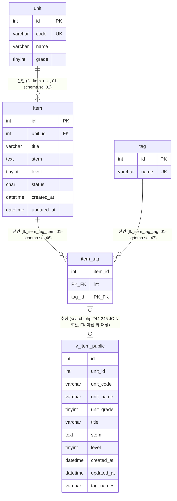

# legacy/item-bank-php 데이터 흐름 — 테이블 · 관계 · 읽기/쓰기

> 전제: `docs/item-bank/ARCHITECTURE.md` 를 먼저 읽고 작성했다. 대상 범위는 `legacy/item-bank-php` 코드가 실제로 접근하는 테이블/뷰로 한정한다.
> 스키마 정의 출처: `db/mariadb/init/01-schema.sql` (compose 가 `/docker-entrypoint-initdb.d` 로 마운트, 01→02→03 순서 실행 — `01-schema.sql:1-2`)

## 0. 스코프 메모

`db/mariadb/init/01-schema.sql` 에는 `class` · `assignment` · `distribution` · `submission` 테이블도 있다(`01-schema.sql:75-115`, 주석 "과제 배포 (assignment-thymeleaf 모듈이 같은 DB를 쓴다)" — `01-schema.sql:73`).
`legacy/item-bank-php/*.php` 전체를 검색한 결과 이 4개 테이블에 대한 참조는 없었다(grep 결과 매치는 모두 HTML `class="..."` 속성이었음). 따라서 아래 표에서 제외했다 — item-bank-php 의 데이터 흐름과 무관.

## 1. 테이블 목록

| 테이블/뷰 | 주요 컬럼 | 근거 |
|---|---|---|
| `unit` | `id`(PK), `code`(UNIQUE), `name`, `grade` | 정의: `01-schema.sql:11-18`. 코드 사용: `register.php:27`, `search.php:125`,`:156`, `units.php:16-19` |
| `item` | `id`(PK), `unit_id`(FK→unit.id), `title`, `stem`, `level`(1~5), `status`(CHAR1, A/R/D), `created_at`, `updated_at` | 정의: `01-schema.sql:20-33`. 코드 사용: `register.php:87`,`:92-98`, `units.php:17`(서브쿼리) |
| `tag` | `id`(PK), `name`(UNIQUE) | 정의: `01-schema.sql:35-40`. 코드 사용: `register.php:34`, `search.php:178`,`:244-245` |
| `item_tag` | `item_id`(PK,FK→item.id), `tag_id`(PK,FK→tag.id) | 정의: `01-schema.sql:42-48`. 코드 사용: `register.php:105-108`, `search.php:244-245` |
| `v_item_public` (뷰, 테이블 아님) | `id`, `unit_id`, `unit_code`, `unit_name`, `unit_grade`, `title`, `stem`, `level`, `created_at`, `updated_at`, `tag_names` | 정의: `01-schema.sql:52-70` (`item` ⋈ `unit`, `status='A'`만, `tag_names`는 `item_tag`⋈`tag` 서브쿼리로 GROUP_CONCAT). 코드 사용: `search.php:521-526`,`:244-245` |

## 2. 테이블 관계

- **선언**(FK 제약): `unit`→`item`(`fk_item_unit`, `01-schema.sql:32`), `item`→`item_tag`(`fk_item_tag_item`, `01-schema.sql:46`), `tag`→`item_tag`(`fk_item_tag_tag`, `01-schema.sql:47`).
- **추정**(코드의 JOIN에서 추정, FK 아님): `search.php:244-245`의 `EXISTS (... WHERE it.item_id = v_item_public.id AND t.name = ?)` — `item_tag.item_id` 를 뷰 `v_item_public.id` 와 직접 비교한다. `v_item_public`은 뷰이므로 FK 대상이 될 수 없어 이 관계는 애플리케이션 코드(SQL)에서만 확인된다.
- `v_item_public` 자체가 `item`/`unit`/`item_tag`/`tag`를 조합해 만들어지는 관계(`01-schema.sql:52-70`)는 뷰 정의문에 그대로 적혀 있어 "추정"이 아니라 뷰 정의 자체이며, 그 안의 조인은 이미 위 "선언" FK와 동일한 컬럼을 사용한다. 그래서 다이어그램에 별도 선으로 표시하지 않고 여기 텍스트로만 남긴다.

## 3. 읽기 · 쓰기 위치 표

| 테이블/뷰 | 읽기 (SELECT) | 쓰기 (INSERT/UPDATE/DELETE) |
|---|---|---|
| `unit` | `units.php` 최상위 스크립트 — `units.php:16-20`; `register.php` 최상위 스크립트 — `register.php:27`; `search.php` `buildSearchQuery()` — `search.php:125`(단일 코드 조회), `:156`(선택 목록) | 없음 (item-bank-php 코드에는 쓰기 없음. 초기 데이터는 `02-seed.sql:9` 이지만 애플리케이션 코드가 아님) |
| `item` | `register.php` 최상위 스크립트 — `register.php:87`(`SELECT ... FOR UPDATE`, 다음 ID 채번); `units.php` 최상위 스크립트 — `units.php:17`(공개 문항 수 서브쿼리, `status='A'`만) | `register.php` 최상위 스크립트 — `register.php:92-98`(`INSERT INTO item ... status='R'` 고정) |
| `tag` | `register.php` 최상위 스크립트 — `register.php:34`; `search.php` `buildSearchQuery()` — `search.php:178`(선택 목록), `:244-245`(EXISTS 서브쿼리 내 JOIN) | 없음 (item-bank-php 코드에는 쓰기 없음. 초기 데이터는 `02-seed.sql:19`) |
| `item_tag` | `search.php` `buildSearchQuery()` — `search.php:244-245`(EXISTS 서브쿼리) | `register.php` 최상위 스크립트 — `register.php:105-108`(`INSERT INTO item_tag`, 유효 태그 수만큼 반복 실행) |
| `v_item_public` | `search.php` `buildSearchQuery()`(SQL 문자열만 조립) — `search.php:521-526`; 실제 실행은 `search.php` `runSearchQuery()` — `search.php:577`,`:600`(`prepare`+`execute`) | 해당 없음 (읽기 전용 뷰) |

`register.php`·`units.php`는 함수 정의 없이 스크립트 최상위 코드로 작성되어 있어 "함수" 대신 "최상위 스크립트"로 표기했다 (`ARCHITECTURE.md` 의 "가장 긴 함수 3개" 절 참고 — 이 두 파일은 함수 정의가 없다).

## 4. 미확인

- `item.status` 의 `'D'`(삭제) 상태로 전이시키는 코드 경로 — item-bank-php 안에서는 확인되지 않음(삭제 UI/엔드포인트 없음). 다른 모듈에서 처리하는지는 미확인.
- `class` · `assignment` · `distribution` · `submission` 테이블의 상세 컬럼/관계 — 스코프 밖이라 상세 분석하지 않음(0절 참고), 필요 시 별도 요청.
- `db/mariadb/init/03-users.sql`(읽기 전용 계정 등 권한 설정 추정) — 아직 읽지 않음.
- 런타임에서 `v_item_public` 뷰가 실제 MariaDB에 이 정의 그대로 생성되어 있는지(마이그레이션 이력, 수동 변경 여부)는 코드 정독만으로는 확인 불가 — 미확인.
